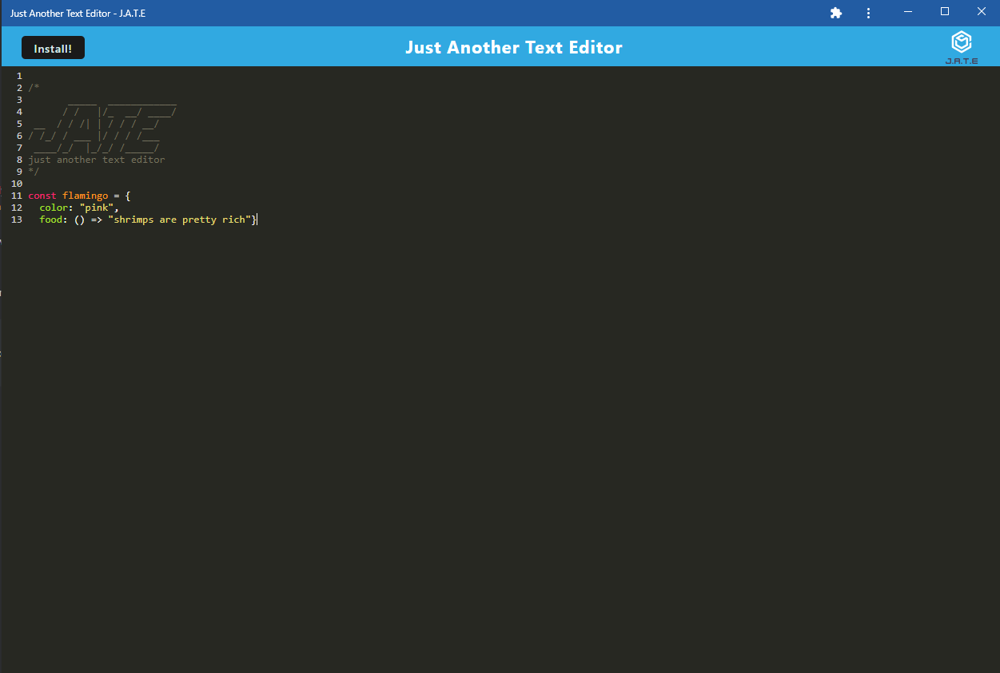

# Just Another Text Editor

## Description
This application allows the user to write notes or code snippets that can be be saved and accessed later. The application can also be installed so the user may use it without needing an internet connection.

[Deployed Link](https://mysterious-spire-07043-db872e238b73.herokuapp.com/)



## Built With
* [JavaScript](https://developer.mozilla.org/en-US/docs/Web/JavaScript)
* [HTML](https://developer.mozilla.org/en-US/docs/Web/HTML)
* [CSS](https://developer.mozilla.org/en-US/docs/Web/CSS)
* [Git](https://git-scm.com/)
* [Node.js](https://nodejs.org/en/about)
* [Express](https://expressjs.com/en/guide/routing.html)
* [Npm](https://www.npmjs.com/about)
* [Webpack](https://webpack.js.org/concepts/)
* [Babel](https://babeljs.io/docs/)
* [Heroku](https://devcenter.heroku.com/categories/deployment)


## Installation

To install necessary dependancies, run the following command: 

```
npm i
```
## Usage
The user can either download the repo from GitHub or go to the deployed site on heroku. If the user downloads the repo, they will need to install dependencies, build the dist with ```npm run build```, and start the application with ```npm start```. Then the user can go to localhost:3000 in their browser to use the application.

## Learning Points
* Utilizing service workers
* Giving functionality to install app from site
* Understanding what a PWA is


## Important Code
```js
butInstall.addEventListener('click', async () => {
  const prompEvent = window.deferredPrompt;
  if (!prompEvent) {
    return;
  }
  prompEvent.prompt();

  window.deferredPrompt = null;

  butInstall.classList.toggle('hidden', false);
});
```
This code allows the user to install the application to their device.

## Author Info

### Timothy Su

* [LinkedIn](https://www.linkedin.com/in/timothysu1/)
* [Github](https://github.com/timothysu1)

## License

Please refer to license in the repo. 

## Contributions
N/A